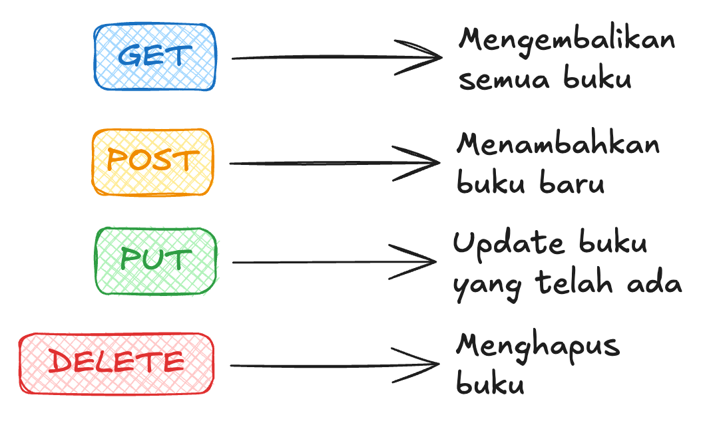
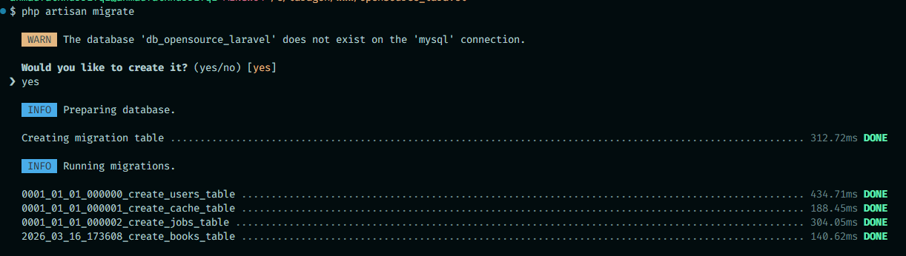
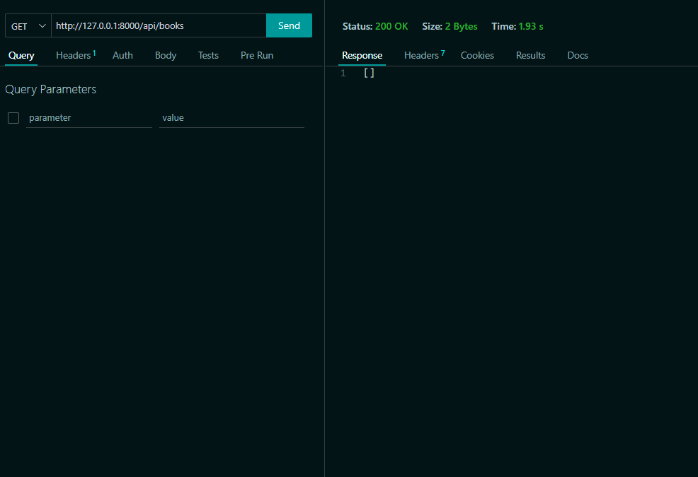
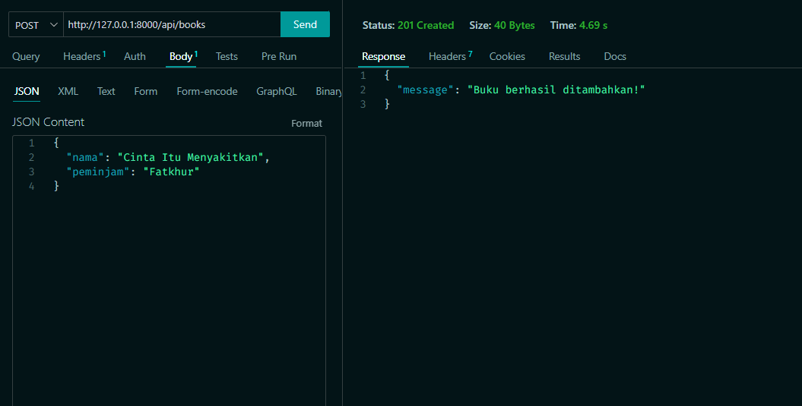
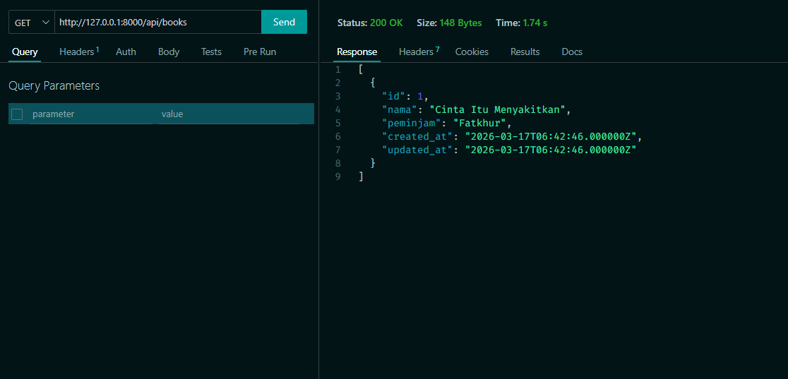

After learning frontend basics with HTML, CSS, and JavaScript, have you ever wondered how sites like Tokopedia, Instagram, TikTok, and others actually work? There are quite a few, right? We could do it all with just frontend — but the data would be static, no posts from other people updating, no new stories.

This is where things get a bit dry because we're dealing with databases, data, logic, and APIs. This is also where your programming understanding gets truly tested!

Think of the **backend** like a kitchen: it prepares the "food" that's then delivered by the waiter (API) to the customer (frontend).

That's the big picture. To make it more concrete, let's jump straight into practice.

## Backend

This is where the programming logic lives. We'll be using **Laravel** — a powerful and elegant PHP framework. The backend covers databases, API routing, business logic, and much more.

### Database

Where do you think sites like Instagram store user data and posts? In Excel, Word, Notepad? Technically possible, but it won't scale. We use a **database** — similar to a table — and there are two main types: **relational** and **non-relational**.

- **Relational** — You define column names and their data types (the structure). Examples: MySQL, PostgreSQL, etc.
- **Non-relational** — No fixed schema; you insert data without defining the structure upfront, often in the form of objects/documents. Examples: MongoDB, Redis.

### Database Setup

- Download [Laragon](https://laragon.org/docs/install). Run the installer and accept the default settings.
- Once installed, open the app and click **Start All**.


- Open `localhost/phpmyadmin` in your browser. Create a new database by clicking **New** in the sidebar, enter a name, then click **Create**.


### API Routing

Complex applications usually have many features — like Instagram: upload, edit, delete, view posts, view profiles, algorithm, etc. We break these down into **routes**. For example:

## Let's Build the API

APIs often expose **CRUD** (Create, Read, Update, Delete) via different routes. For example:



- **GET** `/posts` — list/view posts
- **PUT** `/posts/{postId}` — update a post by ID

### How Do You Run It?

First, install [Composer](https://getcomposer.org/download). We'll use **Laravel** to manage both the API and the database.

---

# Laravel

Laravel is a PHP framework that already covers almost everything we need: routing, ORM, validation, and much more.

Make sure **PHP** and **Composer** (PHP's package manager, like NPM but for PHP) are already installed. Check with:

```bash
php -v
composer -v
```

Create a new Laravel project and navigate into the folder:

```bash
composer create-project laravel/laravel library
cd library
```

This is like `npm init -y` but far more complete — Laravel immediately sets up the entire project structure.

## Fundamentals

### Important Folder Structure

```
library/
├── app/
│   ├── Http/
│   │   ├── Controllers/     ← request logic
│   │   └── Requests/        ← request validation
│   └── Models/              ← database table representation
├── routes/
│   ├── api.php              ← API route definitions
│   └── web.php              ← routes for web pages
├── database/
│   └── migrations/          ← table structure (like Prisma schema)
├── .env                     ← configuration & secret variables
└── artisan                  ← Laravel's built-in CLI tool
```

### Installing Packages

To install a package in Laravel, use Composer:

```bash
composer require [package-name]
```

Example:

```bash
composer require laravel/sanctum
```

For packages only needed during **development**, use the `--dev` flag:

```bash
composer require --dev barryvdh/laravel-debugbar
```

In `composer.json`, installed packages appear under `require` or `require-dev`:

```json
{
  "name": "laravel/laravel",
  "require": {
    "php": "^8.2",
    "laravel/framework": "^11.0"
  },
  "require-dev": {
    "barryvdh/laravel-debugbar": "^3.13"
  }
}
```

### .env

The `.env` file is one of the most important files for storing **secret variables**. Its values live on the server, not in the code — so they stay safe. Examples: database connection, port, API keys.

Laravel automatically reads `.env` without needing to install any additional library.

**.env**

```
APP_NAME=Library
APP_PORT=8000

DB_CONNECTION=mysql
DB_HOST=127.0.0.1
DB_PORT=3306
DB_DATABASE=library
DB_USERNAME=root
DB_PASSWORD=
```

From anywhere in Laravel, access `.env` variables using the `env()` helper:

```php
$dbName = env('DB_DATABASE'); // 'library'
```

Or use `config()` to access pre-mapped configuration:

```php
$dbName = config('database.connections.mysql.database');
```

### Running the App

**Standard way**

```bash
php artisan serve
```

**With a custom port**

```bash
php artisan serve --port=8080
```

Unlike Node.js which requires a manual restart on every change, you can use **[Vite HMR](https://laravel.com/docs/vite)** for the frontend, or simply save & refresh for the backend — since PHP is a scripting language, every request always reads the latest file.

### Artisan CLI

`artisan` is Laravel's built-in CLI tool, like the Swiss Army Knife of Laravel. Some frequently used commands:

```bash
php artisan serve           # Start the development server
php artisan make:model      # Create a new Model
php artisan make:controller # Create a new Controller
php artisan migrate         # Run migrations to the database
php artisan route:list      # View all registered routes
php artisan tinker          # Interactive REPL for testing
```

---

# Library

There's a library that needs modernizing. You have an idea: build a web app so book loans are tracked automatically and digitally. You could use Google Sheets — but we can build something simpler and more minimal, with only the features needed, without all the menus and complexity of a spreadsheet. Curious how? Let's get started!

## Initial Overview

This continues from the **syntax** module. Make sure you've already installed Laravel and set up Composer. Here's the structure of our API workflow:


## Ready?

### Initial Laravel Setup

Create a new project and configure `.env`:

```
library
├── app/
├── database/
├── routes/
├── .env
└── artisan
```

**.env**

```
APP_PORT=8000
DB_CONNECTION=mysql
DB_HOST=127.0.0.1
DB_PORT=3306
DB_DATABASE=library
DB_USERNAME=root
DB_PASSWORD=
```

Start the server:

```bash
php artisan serve
```

Open your browser to `localhost:8000`. Laravel already displays a welcome page by default because there's a route in `routes/web.php`.

### Migration & Model Setup

In Node.js we use Prisma to define the schema and interact with the database. In Laravel, we use **Migrations** for table structure and **Eloquent ORM** for database operations — both are built-in.

Create a Model and Migration at the same time with a single command:

```bash
php artisan make:model Book --migration
```

This creates two files: `app/Models/Book.php` and a migration file in `database/migrations/`.

Open the migration file (its name has a timestamp, like `2024_01_01_000000_create_books_table.php`) and edit it:

**database/migrations/xxxx_create_books_table.php**

```php
public function up(): void
{
    Schema::create('books', function (Blueprint $table) {
        $table->uuid('id');
        $table->string('name')->unique();
        $table->string('borrower');
        $table->timestamps();
    });
}
```

- `uuid('id')` — a unique id in the form of a random string (equivalent to `@default(uuid())` in Prisma)
- `string('name')->unique()` — a name field that cannot be duplicated
- `timestamps()` — automatically adds `created_at` and `updated_at` columns

Apply the migration to the database:

```bash
php artisan migrate
```

Open your terminal — the `books` table is already there!



### Model Setup

Open `app/Models/Book.php` and add the configuration:

```php
<?php

namespace App\Models;

use Illuminate\Database\Eloquent\Model;

class Book extends Model
{
    // Since our id uses UUID (string), not an auto-increment integer
    protected $keyType = 'string';
    public $incrementing = false;

    // Whitelist of fields that can be filled (mass assignment security)
    protected $fillable = [
        'name',
        'borrower',
    ];
}
```

`$fillable` is equivalent to defining which fields can be updated directly from a request. This is a Laravel security feature.

### Enable API Routes

In Laravel 11+, run this command once:

```bash
php artisan install:api
```

This activates `routes/api.php`. All routes in this file automatically get the `/api` prefix — so the `/books` route is accessible at `http://localhost:8000/api/books`.

---

## Let's Build the API

APIs typically expose **CRUD** (Create, Read, Update, Delete) operations via different routes. For example:

- **GET** `http://localhost:8000/api/books` — list all books
- **POST** `http://localhost:8000/api/books` — add a book
- **PUT** `http://localhost:8000/api/books/123` — update the book with id `123`
- **DELETE** `http://localhost:8000/api/books/123` — delete the book with id `123`

### Create a Controller

```bash
php artisan make:controller BookController --api
```

The `--api` flag immediately creates a template with the CRUD methods needed.

### Register Routes

Open `routes/api.php`:

```php
use App\Http\Controllers\BookController;

Route::apiResource('books', BookController::class);
```

This single line automatically registers **7 routes at once**! Check with:

```bash
php artisan route:list
```

### Testing the API

Use a lightweight VS Code extension like **Thunder Client** to test your API.


### GET `/api/books`

Open `app/Http/Controllers/BookController.php` and fill in the `index()` method:

```php
use App\Models\Book;

public function index()
{
    $data = Book::all();
    return response()->json($data, 200);
}
```

`Book::all()` retrieves all data from the table.

Open **Thunder Client**, send a GET request to `http://localhost:8000/api/books`, and click **Send**. The response will be `[]` since no books have been added yet.



### POST `/api/books`

Here we read data from the request body.

```php
use Illuminate\Http\Request;
use Illuminate\Support\Str;

public function store(Request $request)
{
    $request->validate([
        'name'     => 'required|string|unique:books',
        'borrower' => 'required|string',
    ]);

    Book::create([
        'id'       => Str::uuid()->toString(),
        'name'     => $request->name,
        'borrower' => $request->borrower,
    ]);

    return response()->json(['message' => 'Book added successfully!'], 201);
}
```

Laravel **automatically** parses the JSON request body. `$request->validate()` also immediately returns a 422 error if validation fails — no manual try/catch needed!

In Thunder Client, change the method to **POST**, add a JSON body like `{"name": "Laskar Pelangi", "borrower": "Budi"}`, and click **Send**. You'll see a success message.



Send a **GET** to `/api/books` again — you'll see the newly added book, complete with its generated UUID `id`.



### PUT `/api/books/{id}`

The route uses `{id}` as a dynamic segment. In Laravel, this parameter is automatically available as a controller method argument.

```php
public function update(Request $request, string $id)
{
    $book = Book::find($id);

    if (!$book) {
        return response()->json(['message' => 'Book not found'], 404);
    }

    $book->update($request->only(['name', 'borrower']));

    return response()->json(['message' => 'Book updated successfully'], 200);
}
```

`Book::find($id)` is equivalent to `db.books.findUnique({ where: { id } })` in Prisma. `$request->only([...])` ensures only the fields we want are updated.

### DELETE `/api/books/{id}`

Same as PUT: find the book by id, then call `delete()`. Try implementing this one yourself!

### Cool-down

Has your API fully implemented CRUD? Are all book routes working, including **Delete**? In the next project we'll add better error handling and a route to fetch a single book by id.

---

# Refinement

Welcome to the final project! Your task is to refine the library API we've built by completing the steps below.

> Before uploading the project, delete the **vendor** folder and make sure `.env` is not included in the upload.

- **#1** Make sure the **DELETE** route works to delete a book by id.
- **#2** Add a **GET** route that returns a single book by id in the `show()` method.
- **#3** Add a status code to every response. Use:

  `return response()->json(['message' => '...'], [status code]);`

  | Status code | When to use                                          |
  | ----------- | ---------------------------------------------------- |
  | 200         | Successfully returned data                           |
  | 201         | Successfully created new data                        |
  | 404         | Data not found                                       |
  | 422         | Validation failed (handled automatically by Laravel) |
  | 500         | Server error                                         |

  For the full list, see [HTTP status codes](https://www.hostinger.com/id/tutorial/http-status-code).

- **#4** Create a separate **Form Request class** for cleaner validation:

```bash
php artisan make:request StoreBookRequest
php artisan make:request UpdateBookRequest
```

```php
// app/Http/Requests/StoreBookRequest.php
public function authorize(): bool
{
    return true; // Set to true to allow the request
}

public function rules(): array
{
    return [
        'name'     => 'required|string|unique:books',
        'borrower' => 'required|string',
    ];
}
```

Then use it in the Controller:

```php
use App\Http\Requests\StoreBookRequest;

public function store(StoreBookRequest $request)
{
    // $request is already validated automatically before reaching here!
    Book::create([
        'id'       => Str::uuid()->toString(),
        'name'     => $request->name,
        'borrower' => $request->borrower,
    ]);

    return response()->json(['message' => 'Book added successfully!'], 201);
}
```

- **#5** Handle exceptions with **try/catch** for unexpected errors:

```php
public function store(StoreBookRequest $request)
{
    try {
        Book::create([
            'id'       => Str::uuid()->toString(),
            'name'     => $request->name,
            'borrower' => $request->borrower,
        ]);

        return response()->json(['message' => 'Book added successfully!'], 201);
    } catch (\Exception $e) {
        return response()->json(['message' => $e->getMessage()], 500);
    }
}
```

<Card title="Submit" icon="upload" href="https://app.fysite.id/submit?course_id=1&subcourse_id=2" arrow="true" cta="Submit here">
  Add your Github link or project on Google Drive, then the community will review and help together. Keep an eye on Discord for the latest updates!
</Card>
