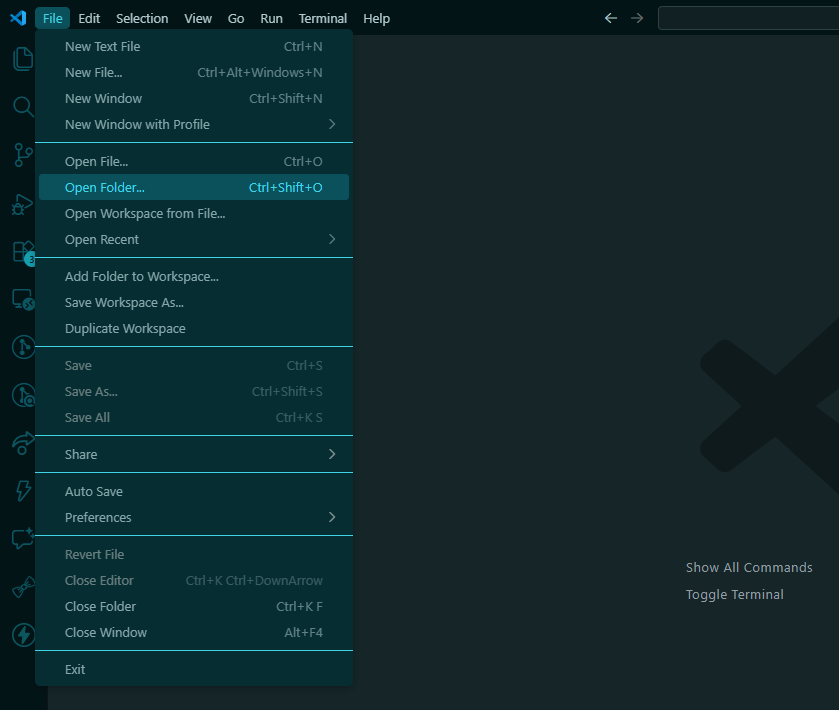
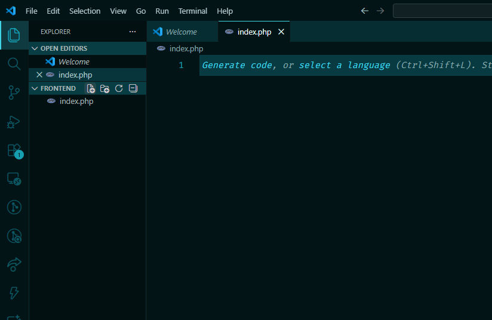
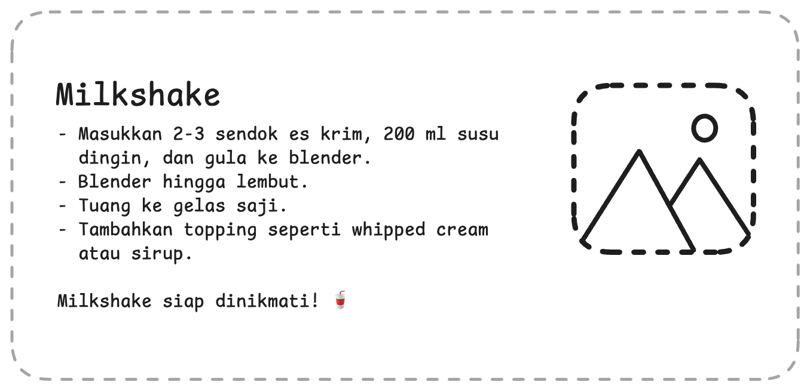
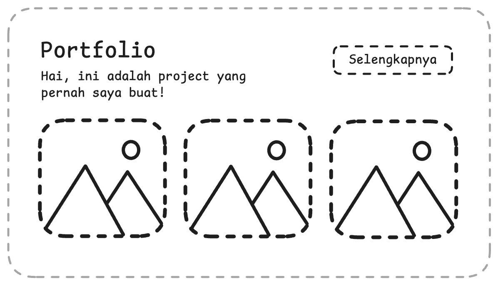

Learning frontend is fun and forms the foundation for what we'll learn next, because we work with the UI and design instead of the terminal. Here the material is summarized and straight to the point!

## Prerequisites

- Download an IDE (where we write code) from this link: [VSCode](https://code.visualstudio.com/download)
- After installing, run the file and follow the instructions

## Let's get started

### Open a project

In Visual Studio Code, click the **File** menu in the top-left corner, then choose **Open Folder**. Create a new folder for this exercise—for example name it `frontend`.



### Create a new file

Click the add-file icon in the sidebar, then type `index.php`. Press Enter to create it. Note that websites generally have this file structure:

- **HTML (Hypertext Markup Language)** `*.html` — the skeleton for elements like headings, text, images, links, buttons, and so on
- **CSS (Cascading Style Sheets)** `*.css` — styling for HTML elements (font-size, color, font, margin, padding, etc.)
- **PHP** `*.php` — server-side logic to generate dynamic content, handle forms, and connect to databases



## HTML

### Comments

```html
<!-- This is a comment -->
```

Anything wrapped between `<!-- ... -->` is not executed by the program—it's only for notes or comments so you (or others) can understand the code.

### Tags

There are many HTML tags, each with a different purpose. See the [full list of tags](https://www.w3schools.com/tags/). There are two kinds of tags (elements) you should know:

**Pair tags**

```html
<tag>content</tag>
```

Examples:

- `<h1>This is a heading</h1>`
- `<p>This is a paragraph</p>`
- `<li>This is a list item</li>` — and many more

**Self-closing tags**

```html
<tag />
```

Examples:

- `` for images
- `<div />` for wrapper/container
- `<br />` for line break — and many more

### Attributes

Attributes are configuration or options you can add to elements (tags). For example: **src**, **style**, and many others. See the [list of attributes](https://www.w3schools.com/tags/ref_attributes.asp).

- ``
- `<h1 style="text-align: center;">Welcome!</h1>`

### HTML structure

```html
<!DOCTYPE html>
<html lang="en">
  <head>
    <title>Personal Portfolio</title>
    <!-- Page title in the browser tab -->
  </head>
  <body>
    <!-- Place your elements here -->
  </body>
</html>
```

This is the required boilerplate to get started. In VSCode you can generate it with the shortcut `! + Tab` (or Enter). This structure includes the page title, metadata, and a **body** where you write the content.

## CSS

Tired of only writing elements with no styling? Time to decorate them with CSS. There are **3 ways** to do it (the 2nd is recommended):

**1. Inline CSS (attribute)**

Easiest, but not recommended—it clutters your HTML when styles get complex and you have many elements.

```html
<h1 style="text-align: center">Welcome!</h1>
```

**2. External CSS (recommended)**

Create a **new CSS file** the same way you created the PHP file—for example name it `style.css`. Then link it from your HTML; make sure the `href` matches your file name.

**Important:** Next, define a class name (e.g. `header`) in your CSS and use that name in the `class` attribute on the elements you want to style.

**index.php**

```php
<!DOCTYPE html>
<html lang="en">
  <head>
    <title>Personal Portfolio</title>
    <link rel="stylesheet" href="style.css" />
    <!-- Link the CSS file from HTML -->
  </head>
  <body>
    <h1 class="header"></h1>
    <!-- Use the class name in the class attribute -->
  </body>
</html>
```

In your CSS file, use the class name you defined, preceded by a dot (meaning "class"), then add properties like `text-align` and more inside curly braces. See the [list of CSS properties](https://www.w3schools.com/cssref/index.php).

**style.css**

```css
.header {
  text-align: center;
}
```

**3. Internal CSS**

Similar to external CSS but not recommended—keeping CSS in a separate file is usually clearer. Add a `<style>` tag after the `<title>` and write your CSS inside it.

```php
<!DOCTYPE html>
<html lang="en">
  <head>
    <title>Document</title>
    <style>
      /* Add a style tag here and write CSS like in the external method */
      .header {
        text-align: center;
      }
    </style>
  </head>
  <body>
    <h1 class="header"></h1>
  </body>
</html>
```

# Systematic thinking

Ever thought about how human logic can be expressed in code? It's possible, though limited—not like AI. Let's get familiar with…

## PHP

Did you know that PHP powers a huge portion of the web, including platforms like WordPress and Facebook (in its early days)? It runs on the server and is great for building dynamic websites and APIs. Want to go deeper?

### Standalone vs connected to HTML

PHP can be run in two ways: through HTML or on its own. How? Read on.

**Standalone**

PHP can be run directly from the terminal. Once PHP is installed, in the terminal run:

```bash
php namafile.php
```

Example:

```bash
php main.php
```

**Connected to HTML**

Unlike CSS or JavaScript, PHP is embedded directly inside HTML using `<?php ... ?>` tags. Save the file with a `.php` extension.

```php
<!DOCTYPE html>
<html lang="en">
  <head>
    <title>Document</title>
  </head>
  <body>
    <?php
      // Your PHP code here
      echo "Hello, World!";
    ?>
  </body>
</html>
```

## Programming concepts

These are the basic concepts of a programming language, especially PHP. The same ideas apply to JavaScript, Python, Java, Go, etc.

### Comments

As in HTML, CSS, and most languages, you can write comments—the syntax is just different. Use `//` or `#`.

```php
// This is a comment
# This also works
```

### Variables

**Syntax**

In PHP, all variables start with a `$` sign. You don't need a keyword like `let` or `const`—just assign directly.

**Mutable variable**

Use for values that may change later. In this example, the value is updated from 10 to 12.

```php
$age = 10;
$age = 12;
```

**Constant**

Use for values that stay the same. If you try to change them, you'll get an error.

```php
define("NAME", "John");
// NAME = "Dewi"; // This will cause an error
```

**Naming rules**

- **No spaces** — Wrong: `$nama lengkap = "john doe"`
- **Camel case** — Correct: `$fullName = "john doe"`
- **Snake case** — Correct: `$full_name = "john doe"`

### Data types

Values stored in variables have different types. Here are some common ones.

**String**

Must be wrapped in single or double quotes, e.g. `"bla bla"`. In other words, text.

```php
$text = "Welcome";
```

**Boolean**

Either **true** or **false**. Often used for conditions or flags.

```php
$isMarried = false;
```

**Integer**

Whole numbers like 8, 1, 3, 100, etc.

```php
$year = 2025;
```

**Array**

Holds multiple values in one variable.

```php
$container = ["joko", 19, true];
```

**Associative Array (Object-like)**

Stores structured information with keys and values.

```php
$user = [
  "username" => "john doe",
  "age" => 12,
  "isMarried" => false,
];
```

### Conditionals

We can combine what we've learned to build more complex programs using conditionals (`if`) and logical operators.

**if**

You can use simple `if`, branching with `else` or `elseif`, combine them, or nest `if` inside `if`.

```php
if (true) {
  // action
}
```

**Logical operators**

Here are some examples. Say we have `$atSchool = false;` and `$age = 3`:

- `!$atSchool` — **!** is negation (the opposite). So this is **true**.
- `$atSchool && $age > 1` — **&&** means "and". Both must be true for the whole expression to be true; if either is false, the whole thing is **false**.
- `$atSchool || $age > 1` — **||** means "or". If at least one is true, the whole expression is **true**.

Once you get this, try to guess the output of:

```php
$isMarried = false;
$age = 28;

if ($isMarried) {
  echo "congrats";
} elseif (!$isMarried && $age > 30) {
  echo "hope you find a match";
} else {
  echo "hang in there";
}
```

### Functions

You know functions from math—they take an input and give an output. In code, functions wrap a set of statements in one place and can take parameters (like f(x) where x is the parameter), use those values, and return a result. In PHP there are built-in functions and user-defined functions.

**Built-in functions**

PHP has many built-in functions—try them on strings, arrays, numbers, etc. Below is an example using string concatenation. When you use libraries, you'll use even more built-ins.

```php
$cityName = "DKI";
echo $cityName . " Jakarta";
// or: echo implode(" ", ["DKI", "Jakarta"]);
```

**User-defined functions**

You can define your own functions. You can have more than one parameter, and the function can **return** a value or not (e.g. it might only call `echo`).

```php
function add($a, $b) {
  return $a + $b;
}
```

## Dynamic HTML with PHP

PHP runs on the **server**, so it generates HTML before it reaches the browser. This is how you make your site dynamic without relying on the browser.

### Step 1: Output dynamic content

Use `echo` to print HTML content from PHP variables.

```php
<?php $title = "Welcome to my site!"; ?>

<!DOCTYPE html>
<html lang="en">
  <head><title>Portfolio</title></head>
  <body>
    <h1 class="header"><?php echo $title; ?></h1>
  </body>
</html>
```

### Step 2: Handle user interaction with forms

Since PHP runs on the server, user interactions (like button clicks) are handled via HTML forms submitted to a PHP script.

**form.php**

```php
<!DOCTYPE html>
<html lang="en">
  <head><title>Form</title></head>
  <body>
    <form method="POST" action="process.php">
      <input type="text" name="username" placeholder="Enter your name" />
      <button type="submit">Submit</button>
    </form>
  </body>
</html>
```

**process.php**

```php
<?php
  $username = $_POST["username"];
  echo "Hello, " . $username . "!";
?>
```

## Ready?

Let's put this into practice by building the project we've designed so you can understand it better!

---

# Layouting

For this project, you're expected to already understand the basics.

## Level 1: Text procedure

Here you need to understand HTML concepts: list elements, headings, images, and CSS: layout, padding, and border. This is the layout prototype—good luck!

### Tips and requirements

- You can use the `float` or `flex` property in CSS
- Include images with `` — you can use a local file (in the same folder) or a URL from the web
- Use list elements in HTML, for example:

```html
<ul>
  <li>List 1</li>
  <li>List 2</li>
</ul>
```



## Level 2: Portfolio section

Here you need to combine HTML (buttons), CSS (layout), and PHP (server-side redirect). This is the layout prototype—good luck!

### Tips and requirements

- When the "See more" (or similar) button is clicked, it should go to your Instagram page. Use a PHP redirect or a simple HTML anchor:

```php
<?php
  // Redirect using PHP (place at top of file, before any HTML output)
  header("Location: https://instagram.com/@username");
  exit();
?>
```

Or simply with an HTML anchor tag:

```html
<a href="https://instagram.com/@username">
  <button>See more</button>
</a>
```

- Match the layout exactly. You can use **flexbox** in CSS:

```html
<div style="display:flex">
  
  
</div>
```



<Card title="Submit" icon="upload" href="https://app.fysite.id/submit?course_id=1&subcourse_id=1" arrow="true" cta="Submit here">
  Add your Github link or project in Google Drive then the community will review and help you together. Please stay tuned on Discord to see the latest updates!
</Card>
