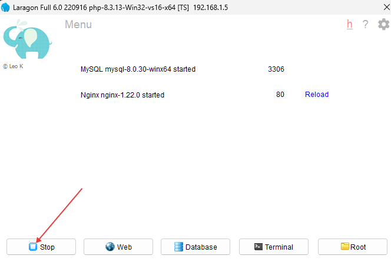
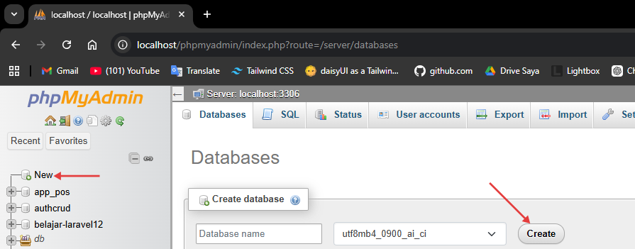
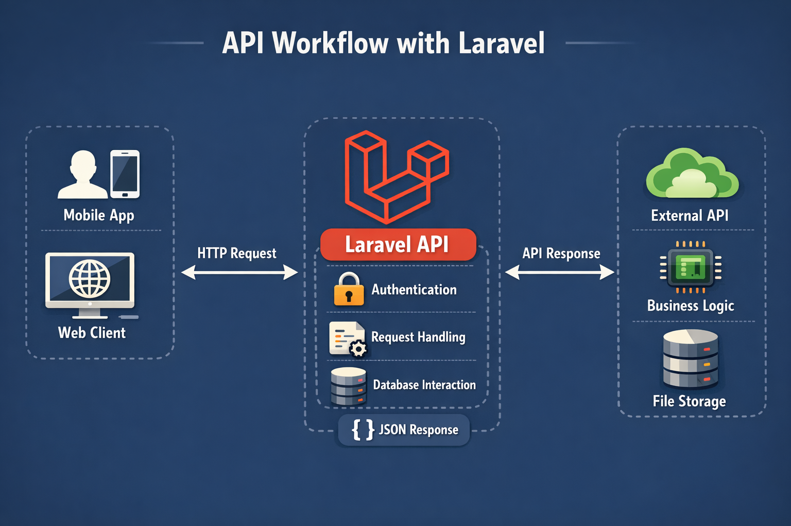

Setelah belajar frontend dasar dengan HTML, CSS, dan JavaScript, pernah bertanya-tanya bagaimana situs seperti Tokopedia, Instagram, TikTok, dan lainnya bekerja? Lumayan banyak ya? Bisa saja kita lakukan dengan frontend saja — tapi datanya akan statis, tidak ada postingan orang lain yang update, tidak ada stories baru.

Di sinilah terasa agak kering karena kita berurusan dengan database, data, logika, dan API. Di sini juga pemahaman programmingmu benar-benar diuji!

Bayangkan **backend** seperti dapur: ia menyiapkan "makanan" yang kemudian diantarkan oleh pelayan (API) ke pelanggan (frontend).

Itu gambaran besarnya. Supaya lebih terasa, yuk langsung praktek.

## Backend

Di sinilah logika pemrograman tinggal. Kita akan memakai **Laravel** — framework PHP yang powerful dan elegan. Backend mencakup database, routing API, logika bisnis, dan masih banyak lagi.

### Database

Menurutmu, di mana situs seperti Instagram menyimpan data pengguna dan postingan? Di Excel, Word, Notepad? Bisa saja, tapi tidak akan scalable. Kita menggunakan **database** — mirip tabel — dan jenisnya ada **relasional** dan **non-relasional**.

- **Relasional** — Kamu mendefinisikan nama kolom dan tipe datanya (strukturnya). Contoh: MySQL, PostgreSQL, dll.
- **Non-relasional** — Tidak ada skema tetap; kamu menyisipkan data tanpa mendefinisikan struktur terlebih dahulu, sering dalam bentuk objek/dokumen. Contoh: MongoDB, Redis.

### Setup database

- Download [Laragon](https://laragon.org/docs/install). Jalankan installer dan terima pengaturan default.
- Setelah instalasi, buka aplikasinya dan klik **Start All**.



- Buka `localhost/phpmyadmin` di browser. Buat database baru dengan klik **New** di sidebar, masukkan nama, lalu klik **Create**.



### API routing

Aplikasi yang kompleks biasanya punya banyak fitur — seperti Instagram: upload, edit, hapus, lihat postingan, lihat profil, algoritma, dll. Kita memecahnya menjadi **routes**. Contohnya:

- **GET** `/posts` — daftar/lihat postingan
- **PUT** `/posts/{postId}` — update postingan berdasarkan ID

### Bagaimana cara menjalankannya?

Install [Composer](https://getcomposer.org/download) terlebih dahulu. Kita akan menggunakan **Laravel** untuk mengelola API dan database sekaligus.

---

# Laravel

Laravel adalah framework PHP yang sudah mencakup hampir semua yang kita butuhkan: routing, ORM, validasi, dan masih banyak lagi.

Pastikan **PHP** dan **Composer** (package manager PHP, seperti NPM tapi untuk PHP) sudah terinstall. Cek dengan:

```bash
php -v
composer -v
```

Buat project Laravel baru dan masuk ke foldernya:

```bash
composer create-project laravel/laravel library
cd library
```

Ini seperti `npm init -y` tapi jauh lebih lengkap — Laravel langsung menyiapkan seluruh struktur project.

## Fundamentals

### Struktur folder penting

```
library/
├── app/
│   ├── Http/
│   │   ├── Controllers/     ← logika request
│   │   └── Requests/        ← validasi request
│   └── Models/              ← representasi tabel database
├── routes/
│   ├── api.php              ← definisi route API
│   └── web.php              ← route untuk halaman web
├── database/
│   └── migrations/          ← struktur tabel (seperti schema Prisma)
├── .env                     ← konfigurasi & variabel rahasia
└── artisan                  ← CLI tool bawaan Laravel
```

### Menginstall package

Untuk menginstall package di Laravel, gunakan Composer:

```bash
composer require [nama-package]
```

Contoh:

```bash
composer require laravel/sanctum
```

Untuk package yang hanya dibutuhkan saat **development**, gunakan flag `--dev`:

```bash
composer require --dev barryvdh/laravel-debugbar
```

Di `composer.json`, package yang kamu install muncul di `require` atau `require-dev`:

```json
{
  "name": "laravel/laravel",
  "require": {
    "php": "^8.2",
    "laravel/framework": "^11.0"
  },
  "require-dev": {
    "barryvdh/laravel-debugbar": "^3.13"
  }
}
```

### .env

File `.env` adalah salah satu file terpenting untuk menyimpan **variabel rahasia**. Nilainya ada di server, bukan di kode — jadi tetap aman. Contoh: koneksi database, port, API key.

Laravel sudah otomatis membaca `.env` tanpa perlu install library tambahan.

**.env**

```
APP_NAME=Library
APP_PORT=8000

DB_CONNECTION=mysql
DB_HOST=127.0.0.1
DB_PORT=3306
DB_DATABASE=library
DB_USERNAME=root
DB_PASSWORD=
```

Di file manapun di Laravel, akses variabel `.env` dengan helper `env()`:

```php
$dbName = env('DB_DATABASE'); // 'library'
```

Atau gunakan `config()` untuk mengakses konfigurasi yang sudah dimapping:

```php
$dbName = config('database.connections.mysql.database');
```

### Menjalankan program

**Cara biasa**

```bash
php artisan serve
```

**Dengan port kustom**

```bash
php artisan serve --port=8080
```

Berbeda dengan Node.js yang harus restart manual setiap ada perubahan, kamu bisa menggunakan **[Vite HMR](https://laravel.com/docs/vite)** untuk frontend, atau cukup save & refresh untuk backend karena PHP adalah scripting language — setiap request selalu membaca file terbaru.

### Artisan CLI

`artisan` adalah perintah CLI bawaan Laravel, seperti Swiss Army Knife-nya Laravel. Beberapa perintah yang sering dipakai:

```bash
php artisan serve          # Jalankan server development
php artisan make:model     # Buat Model baru
php artisan make:controller # Buat Controller baru
php artisan migrate        # Jalankan migration ke database
php artisan route:list     # Lihat semua route yang terdaftar
php artisan tinker         # REPL interaktif untuk testing
```

---

# Library

Ada perpustakaan yang butuh modernisasi. Kamu punya ide: buat web app agar peminjaman buku terlacak otomatis dan digital. Kamu bisa pakai Google Sheets — tapi kita bisa buat sesuatu yang lebih sederhana dan minimal, dengan hanya fitur yang dibutuhkan, bukan semua menu dan kompleksitas spreadsheet. Penasaran caranya? Ayo mulai!

## Gambaran awal

Ini melanjutkan dari modul **syntax**. Pastikan kamu sudah menginstall Laravel dan setup Composer. Berikut struktur workflow API kita:



## Siap?

### Setup awal Laravel

Buat project baru dan konfigurasi `.env`:

```
library
├── app/
├── database/
├── routes/
├── .env
└── artisan
```

**.env**

```
APP_PORT=8000
DB_CONNECTION=mysql
DB_HOST=127.0.0.1
DB_PORT=3306
DB_DATABASE=library
DB_USERNAME=root
DB_PASSWORD=
```

Jalankan server:

```bash
php artisan serve
```

Buka browser ke `localhost:8000`. Laravel sudah menampilkan halaman welcome secara default karena ada route di `routes/web.php`.

### Setup Migration & Model

Di Node.js kita memakai Prisma untuk mendefinisikan skema dan berinteraksi dengan database. Di Laravel, kita pakai **Migration** untuk struktur tabel dan **Eloquent ORM** untuk operasi database — keduanya sudah built-in.

Buat Model dan Migration sekaligus dengan satu perintah:

```bash
php artisan make:model Book --migration
```

Ini membuat dua file: `app/Models/Book.php` dan file migration di `database/migrations/`.

Buka file migration (namanya ada timestamp, seperti `2024_01_01_000000_create_books_table.php`) dan edit:

**database/migrations/xxxx_create_books_table.php**

```php
public function up(): void
{
    Schema::create('books', function (Blueprint $table) {
        $table->uuid('id')->primary()->default(DB::raw('(UUID())'));
        $table->string('nama')->unique();
        $table->string('peminjam');
        $table->timestamps();
    });
}
```

- `uuid('id')` — id unik berbentuk string random (setara `@default(uuid())` di Prisma)
- `string('nama')->unique()` — field nama yang tidak boleh duplikat
- `timestamps()` — otomatis menambah kolom `created_at` dan `updated_at`

Terapkan migration ke database:

```bash
php artisan migrate
```

Buka phpMyAdmin — tabel `books` sudah muncul!


### Setup Model

Buka `app/Models/Book.php` dan tambahkan konfigurasi:

```php
<?php

namespace App\Models;

use Illuminate\Database\Eloquent\Model;

class Book extends Model
{
    // Karena id kita pakai UUID (string), bukan auto-increment integer
    protected $keyType = 'string';
    public $incrementing = false;

    // Whitelist field yang boleh diisi (keamanan mass assignment)
    protected $fillable = [
        'nama',
        'peminjam',
    ];
}
```

`$fillable` setara dengan mendefinisikan field mana yang boleh diupdate langsung dari request. Ini adalah fitur keamanan Laravel.

### Aktifkan API Routes

Di Laravel 11+, jalankan perintah ini sekali:

```bash
php artisan install:api
```

Ini mengaktifkan `routes/api.php`. Semua route di file ini otomatis punya prefix `/api` — jadi route `/books` bisa diakses di `http://localhost:8000/api/books`.

---

## Mari Bangun API-nya

API biasanya mengekspos operasi **CRUD** (Create, Read, Update, Delete) lewat route yang berbeda. Contohnya:

- **GET** `http://localhost:8000/api/books` — list semua buku
- **POST** `http://localhost:8000/api/books` — tambah buku
- **PUT** `http://localhost:8000/api/books/123` — update buku dengan id `123`
- **DELETE** `http://localhost:8000/api/books/123` — hapus buku dengan id `123`

### Buat Controller

```bash
php artisan make:controller BookController --api
```

Flag `--api` langsung membuat template dengan method-method CRUD yang dibutuhkan.

### Daftarkan Route

Buka `routes/api.php`:

```php
use App\Http\Controllers\BookController;

Route::apiResource('books', BookController::class);
```

Satu baris ini otomatis mendaftarkan **7 route sekaligus**! Cek dengan:

```bash
php artisan route:list
```

### Testing API

Gunakan ekstensi VS Code ringan seperti **Thunder Client** untuk testing API-mu.


### GET `/api/books`

Buka `app/Http/Controllers/BookController.php` dan isi method `index()`:

```php
use App\Models\Book;

public function index()
{
    $data = Book::all();
    return response()->json($data, 200);
}
```

`Book::all()` setara dengan `db.books.findMany()` di Prisma — mengambil semua data dari tabel.

Buka **Thunder Client**, kirim GET request ke `http://localhost:8000/api/books`, dan klik **Send**. Responsnya `[]` karena belum ada buku yang ditambahkan.


### POST `/api/books`

Di sini kita membaca data dari request body.

```php
use Illuminate\Http\Request;
use Illuminate\Support\Str;

public function store(Request $request)
{
    $request->validate([
        'nama'     => 'required|string|unique:books',
        'peminjam' => 'required|string',
    ]);

    Book::create([
        'id'       => Str::uuid()->toString(),
        'nama'     => $request->nama,
        'peminjam' => $request->peminjam,
    ]);

    return response()->json(['message' => 'Buku berhasil ditambahkan!'], 201);
}
```

Berbeda dari Express yang butuh `app.use(express.json())`, Laravel **otomatis** mem-parse JSON request body. `$request->validate()` juga langsung mengembalikan error 422 jika validasi gagal — tidak perlu try/catch manual!

Di Thunder Client, ganti method ke **POST**, tambahkan JSON body seperti `{"nama": "Laskar Pelangi", "peminjam": "Budi"}`, dan klik **Send**. Kamu akan melihat pesan sukses.


Kirim **GET** ke `/api/books` lagi — kamu akan melihat buku yang baru ditambahkan, lengkap dengan `id` UUID yang digenerate.


### PUT `/api/books/{id}`

Route menggunakan `{id}` sebagai segmen dinamis. Di Laravel, parameter ini otomatis tersedia sebagai argumen method controller.

```php
public function update(Request $request, string $id)
{
    $book = Book::find($id);

    if (!$book) {
        return response()->json(['message' => 'Buku tidak ditemukan'], 404);
    }

    $book->update($request->only(['nama', 'peminjam']));

    return response()->json(['message' => 'Buku berhasil diupdate'], 200);
}
```

`Book::find($id)` setara dengan `db.books.findUnique({ where: { id } })` di Prisma. `$request->only([...])` memastikan hanya field yang kita inginkan yang diupdate.

### DELETE `/api/books/{id}`

Sama seperti PUT: ambil buku berdasarkan id, lalu panggil `delete()`. Coba implementasikan sendiri!

### Cool-down

Apakah API-mu sudah mengimplementasikan CRUD sepenuhnya? Apakah semua route buku berfungsi, termasuk **Delete**? Di project berikutnya kita akan menambahkan penanganan error yang lebih baik dan route untuk mengambil satu buku berdasarkan id.

---

# Refinement

Selamat datang di project akhir! Tugasmu adalah menyempurnakan API library yang sudah kita buat dengan menyelesaikan langkah-langkah di bawah ini.

> Sebelum mengupload project, hapus folder **vendor** dan pastikan `.env` tidak ikut terupload.

- **#1** Pastikan route **DELETE** sudah berfungsi untuk menghapus buku berdasarkan id.
- **#2** Tambahkan route **GET** yang mengembalikan satu buku berdasarkan id di method `show()`.
- **#3** Tambahkan status code ke setiap response. Gunakan:

  `return response()->json(['message' => '...'], [status code]);`

  | Status code | Kapan digunakan?                       |
  | ----------- | -------------------------------------- |
  | 200         | Sukses mengembalikan data              |
  | 201         | Sukses membuat data baru               |
  | 404         | Data tidak ditemukan                   |
  | 422         | Validasi gagal (otomatis oleh Laravel) |
  | 500         | Error server                           |

  Untuk daftar lengkap, lihat [HTTP status codes](https://www.hostinger.com/id/tutorial/http-status-code).

- **#4** Buat **Form Request class** terpisah untuk validasi yang lebih rapi:

```bash
php artisan make:request StoreBookRequest
php artisan make:request UpdateBookRequest
```

```php
// app/Http/Requests/StoreBookRequest.php
public function authorize(): bool
{
    return true; // Set ke true agar request diizinkan
}

public function rules(): array
{
    return [
        'nama'     => 'required|string|unique:books',
        'peminjam' => 'required|string',
    ];
}
```

Lalu gunakan di Controller:

```php
use App\Http\Requests\StoreBookRequest;

public function store(StoreBookRequest $request)
{
    // $request sudah tervalidasi otomatis sebelum masuk ke sini!
    Book::create([
        'id'       => Str::uuid()->toString(),
        'nama'     => $request->nama,
        'peminjam' => $request->peminjam,
    ]);

    return response()->json(['message' => 'Buku berhasil ditambahkan!'], 201);
}
```

- **#5** Tangani exception dengan **try/catch** untuk error yang tidak terduga:

```php
public function store(StoreBookRequest $request)
{
    try {
        Book::create([
            'id'       => Str::uuid()->toString(),
            'nama'     => $request->nama,
            'peminjam' => $request->peminjam,
        ]);

        return response()->json(['message' => 'Buku berhasil ditambahkan!'], 201);
    } catch (\Exception $e) {
        return response()->json(['message' => $e->getMessage()], 500);
    }
}
```

<Card title="Submit" icon="upload" href="https://app.fysite.id/submit?course_id=1&subcourse_id=2" arrow="true" cta="Submit di sini">
  Tambahkan link Github atau project di Google Drive, lalu komunitas akan me-review dan membantu bersama-sama. Pantau terus Discord untuk update terbaru!
</Card>
