React.js is a JavaScript library for building interactive user interfaces (UI). With React, you build small, reusable components—like buttons or forms—and compose them into full application views. React is efficient thanks to the Virtual DOM: only the parts that change get updated, without refreshing the whole page. It’s widely used for fast, dynamic, and responsive modern web apps.

## Module goals

- Understand the basics of React.js and how it works
- Build an interactive front-end application with React.js
- Connect a React app to a backend via an API

## Prerequisites

Before starting this module, you should be comfortable with:

- HTML, CSS, and JavaScript (including ES6)
- Node.js and NPM
- Basic Git for managing projects

---

# Installation

**Introduction** — React.js can be installed in several ways. The two most common are:

- **Create React App (CRA)** — the classic way to start a React project
- **Vite** — a modern build tool that’s lighter and faster

In this module we use **Vite** for installation.

## Why install with Vite?

Vite is a modern build tool built to speed up web development, including React.js apps. Compared to tools like Create React App (CRA), Vite has several advantages:

- **Faster development** — quicker startup and hot reload
- **Smaller project footprint** — less tooling overhead
- **Modern JavaScript and TypeScript** — native ESM support
- **Faster dev server** — instant server start

> Although Vite can feel a bit more technical at first, the long-term benefits for productivity and performance are significant.

### Let’s run the installer

**Open a terminal**

**Go to your project directory**

```bash
cd "nama-proyek"
```

(Use your actual project folder name.)

**Create a new project with Vite**

Run:

```bash
npm create vite
```

Then enter your project name when prompted.

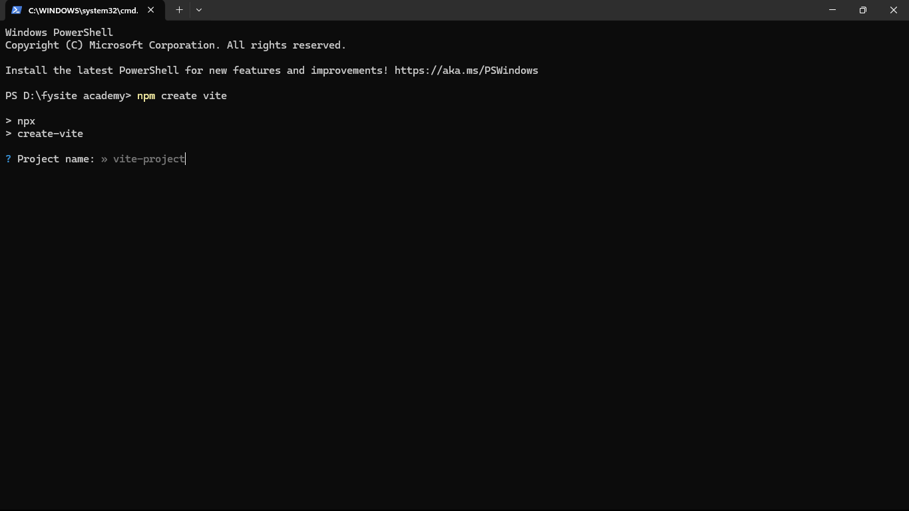

Choose the framework template. For this React module, select **React**.

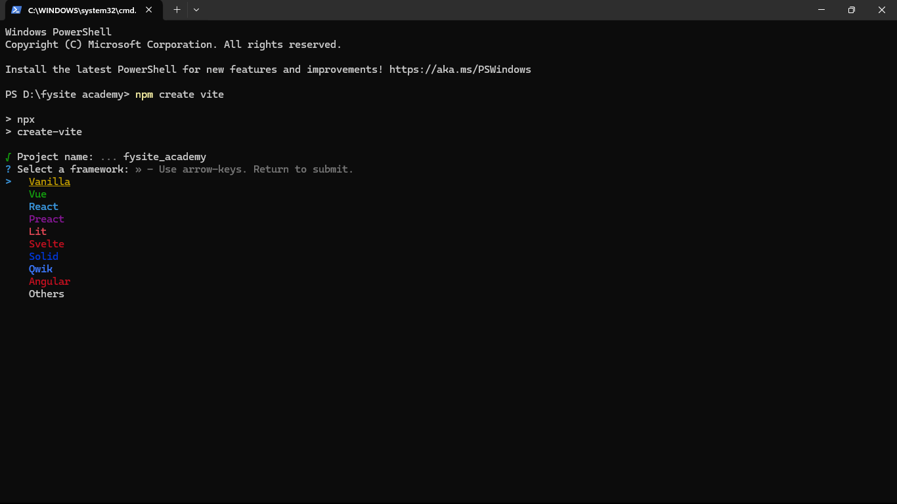

Next, pick a variant (e.g. **JavaScript** or TypeScript). We’ll use **JavaScript** here.

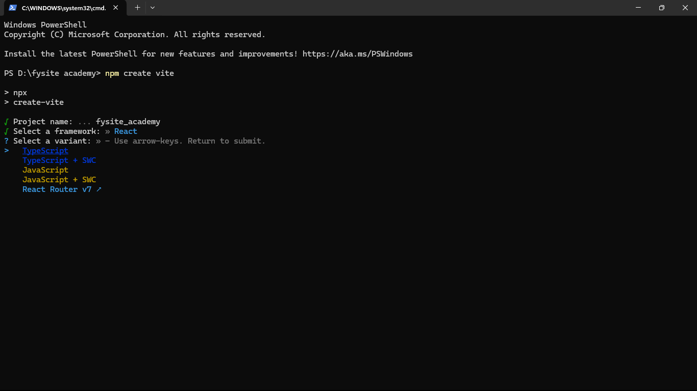

**Enter the project directory**

```bash
cd nama-proyek
```

(Replace `nama-proyek` with the name you gave the project.)

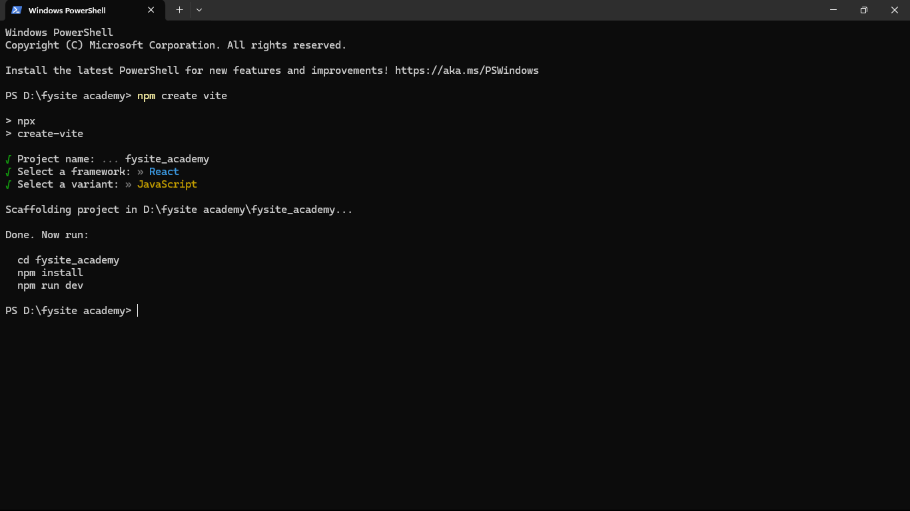

Inside the project folder, install dependencies with:

```bash
npm install
```

as suggested by the Vite output. After that you can:

- Run the project (e.g. `npm run dev`), or
- Open it in your IDE (e.g. VS Code) with:

```bash
code .
```

---

# Hello World in React

The React template structure can be confusing at first. Here’s where the main application code lives:

- **App.js** — The main React component. Your app logic starts here.
- **App.css** — Styles for the component in App.js.
- **index.js** — The entry point. It renders your React component into the DOM (via `index.html`).

Understanding JavaScript (and the DOM) first really helps with React, since React works with the same ideas.

## How to build “Hello World” in React

1. Open `src/App.js` in your editor.
2. Remove the default content (the highlighted/blocked part in the screenshot below).

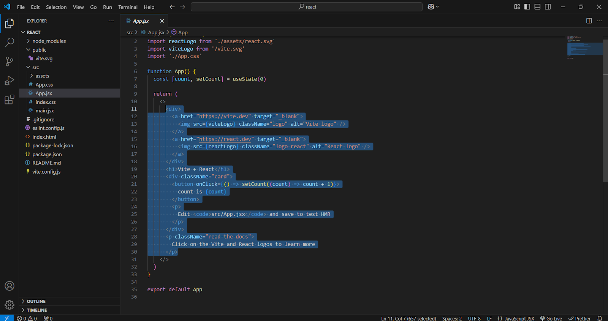

3. Replace it with a simple `<h1>` that says “Hello World!”.
4. Save and check the browser. You should see something like:

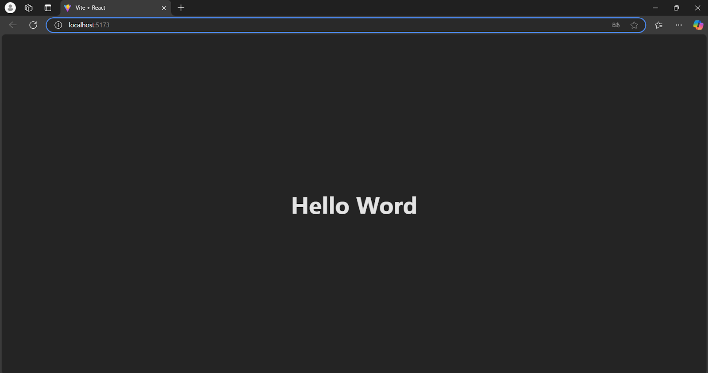

## You’ve built Hello World in React

Well done — you’ve got your first React “Hello World” running.

---

# Creating components

## What is a component?

In React, **components** are the building blocks of the user interface (UI). A component can be a piece of UI (e.g. a button, an input, a form) or logic that produces UI. Components are **reusable**—you can use the same component in different parts of your app.

## How to create a component

1. Create a folder inside `/src`—e.g. `components`. The name is up to you; `components` is used here for clarity.
2. Inside that folder, create a `.jsx` file (e.g. `Fysite.jsx`).

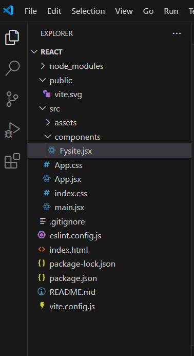

That's where you'll define your component.

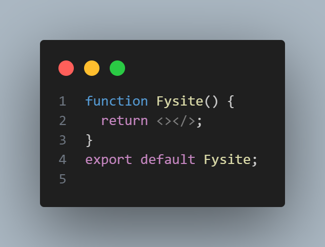

Here we've created a component named **Fysite**. Inside it you can return whatever you want to show on the page—for example a paragraph.

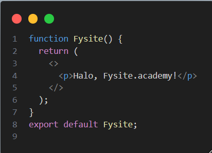

After adding the paragraph, you might wonder why it doesn't show on the site yet. A component only exists in the file where you write it. For React to show it on the page, you have to **import and render** that component where you want it to appear.

## How to show the component on the page

**Import the component in App.js** — To display the Fysite component, import it in `App.js` and use it in your JSX:

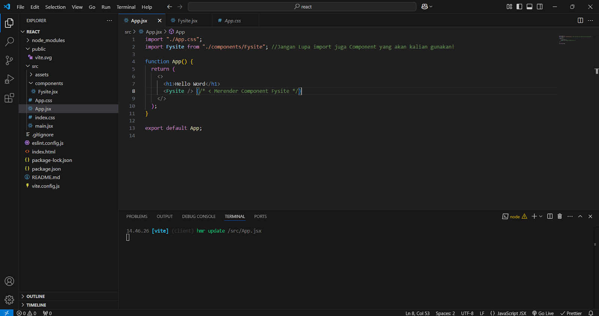

That's how you import and use a component in React. Refresh your app and the paragraph from the Fysite component should appear.

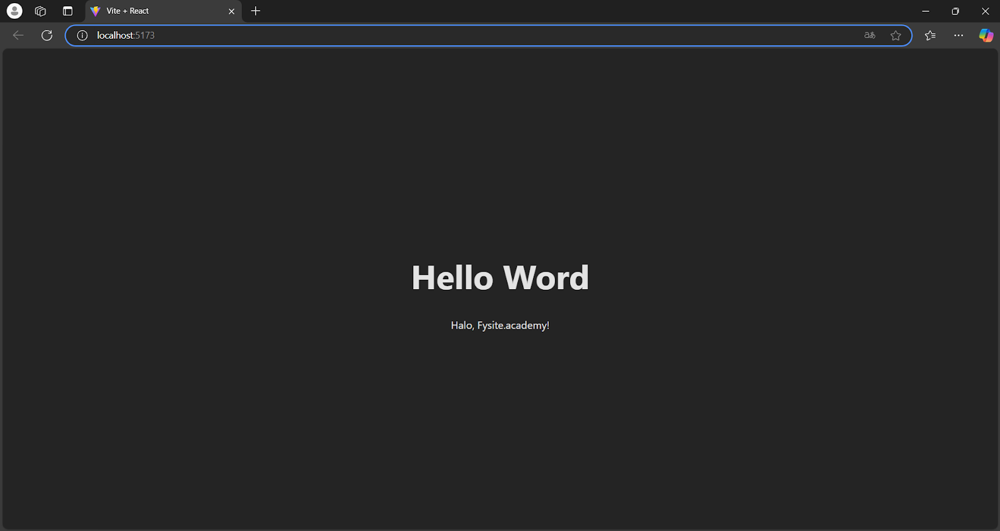

There it is. Creating and using components in React is that straightforward.

## Summary

- Create a component (e.g. Fysite) in its own file.
- Import it in the file where you want it to show (e.g. `App.js`).
- Use it in JSX (e.g. `<Fysite />`).

You've got this. Quick check:

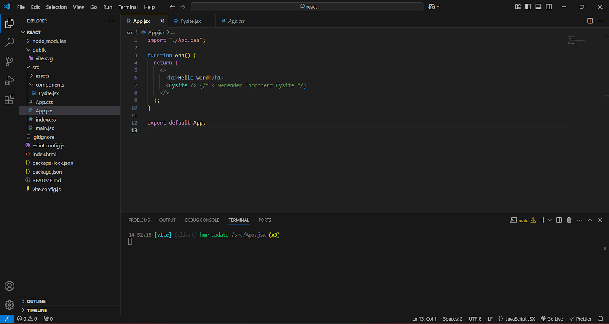

**Quiz:** If you only add `<Fysite />` in `App.js` but never add the `import` statement for Fysite, will the Fysite component work? (No—you must import it first.)

---

# Props

## What are props in React?

**Props** are how a parent component passes data down to a child component. If a component needs something from the outside, the parent sends it via props—like a package from parent to child.

Think of it this way: the parent (e.g. "Mama") gives a gift to the child (e.g. "Baby"). The gift is the props.

## Example: props in React

```javascript
function Hadiah(props) {
  return <h2>Ini hadiah dari Mama: {props.namaHadiah} 🎁</h2>;
}

function Mama() {
  return <Hadiah namaHadiah="Boneka Beruang" />;
}
```

**Explanation:**

- **Mama** (parent) passes the prop `namaHadiah="Boneka Beruang"` to **Hadiah** (child).
- **Hadiah** receives that prop and displays it.

So the result is: **"Ini hadiah dari Mama: Boneka Beruang 🎁"** (or in English: "This gift from Mama: Teddy Bear 🎁").

### Props are read-only

Props are like a gift from the parent—the child can use them but cannot change them. A child component should not modify the props it receives.

### Props can be anything

You can pass many types of values as props:

- **String:** `<Hadiah namaHadiah="Mobil Mainan" />`
- **Number:** `<Hadiah jumlah={3} />` (use `{3}` for numbers in JSX)
- **Boolean:** `<Hadiah isBaru={true} />`
- **Object:** `<Hadiah info={{ nama: "Kue", rasa: "Coklat" }} />`
- **Function:** `<Hadiah onClick={handleKlik} />`

### Summary

- Props are data passed from a parent component to a child component.
- Props are read-only; the child should not mutate them.
- Props can be strings, numbers, booleans, objects, functions, etc.

---

# State, useState, and useEffect

State, `useState`, and `useEffect` are essential for building interactive React apps. Here's how they work.

## 1. What is state?

**State** is data that can change over time—like a component's "mood." When state changes, React re-renders the component so the UI stays in sync.

Think of a **toy lamp** with a button:

- Press once → the lamp turns **on**
- Press again → the lamp turns **off**

The lamp has **state**: either **ON** or **OFF**. State matters because your app often needs to **update in response to user actions**.

## 2. Using useState to manage state

React's **useState** hook lets you store and update state inside a component.

### Example 1: Light on/off button

```javascript
import { useState } from "react";

function Lampu() {
  const [nyala, setNyala] = useState(false); // Lamp starts off

  return (
    <div>
      <h2>Lampu: {nyala ? "💡 NYALA" : "🌑 MATI"}</h2>
      <button onClick={() => setNyala(!nyala)}>Tekan!</button>
    </div>
  );
}
```

**Explanation:**

- `useState(false)` means the lamp **starts off**
- `setNyala(!nyala)` **toggles** the state each time the button is clicked

Pressing the button switches the lamp between on and off.

### Example 2: Count bottles

```javascript
import { useState } from "react";

function BotolSusu() {
  const [jumlah, setJumlah] = useState(5); // Start with 5 bottles

  return (
    <div>
      <h2>Jumlah botol susu: {jumlah} 🍼</h2>
      <button onClick={() => setJumlah(jumlah - 1)}>Minum Susu</button>
    </div>
  );
}
```

**Explanation:**

- `useState(5)` sets the initial count to 5
- `setJumlah(jumlah - 1)` decreases the count by 1 when the button is clicked

Each click reduces the bottle count by one.

## 3. What is useEffect?

**useEffect** runs code in response to changes—for example when state changes, or when the component first appears. Use it for "side effects" that react to your app's data.

Examples:

- Show a message when a value reaches zero (e.g. "Out of milk!")
- Update the browser tab title when data changes
- Fetch data from an API when the component mounts or when a dependency changes

### Example 1: Alert when bottles reach zero

```javascript
import { useState, useEffect } from "react";

function BotolSusu() {
  const [jumlah, setJumlah] = useState(5);

  useEffect(() => {
    if (jumlah === 0) {
      alert("Susu habis! 🍼🚨");
    }
  }, [jumlah]);

  return (
    <div>
      <h2>Jumlah botol susu: {jumlah} 🍼</h2>
      <button onClick={() => setJumlah(jumlah - 1)}>Minum Susu</button>
    </div>
  );
}
```

**Explanation:**

- `useEffect(() => { ... }, [jumlah])` runs whenever `jumlah` changes
- When `jumlah` becomes 0, the alert appears

So when the bottles run out, the user gets a warning.

### Example 2: Update page title when state changes

```javascript
import { useState, useEffect } from "react";

function Halaman() {
  const [judul, setJudul] = useState("Halo, Dunia!");

  useEffect(() => {
    document.title = judul; // Change the browser tab title
  }, [judul]);

  return (
    <div>
      <h2>Judul Halaman: {judul}</h2>
      <button onClick={() => setJudul("Judul Baru!")}>Ubah Judul</button>
    </div>
  );
}
```

**Explanation:**

- Whenever `judul` changes, the browser's document title updates to match

## 4. When to use useEffect

Use **useEffect** when you need to:

- Run code when the component **first mounts**
- Run code when **specific state or props change** (list them in the dependency array)
- **Clean up** (e.g. cancel subscriptions) when the component unmounts

Real-world examples:

- **Battery check** — e.g. "Battery at 10%!"
- **Chat notifications** — e.g. "You have 3 new messages!"
- **Fetch from API** — load and display the latest data when the component mounts or when a dependency changes

## 5. Summary

- **State** — Data that can change; when it changes, the component re-renders.
- **useState** — Hook to declare and update state.
- **useEffect** — Hook to run side effects when the component mounts or when dependencies change.
  - React to state/props changes (e.g. update title, show alert)
  - Run code once on mount (e.g. fetch data)
  - Optionally clean up on unmount

---

# What is an API?

An **API (Application Programming Interface)** is like a restaurant:

- **We (frontend)** = the customer who orders
- **API** = the waiter who takes the order to the kitchen
- **Backend (server)** = the kitchen that prepares the food
- **JSON data** = the food delivered to the customer

So the API is the **bridge** that lets your app get data from the server or send data to it.

Below we fetch data from an API using **Axios (GET)** in React, using [JSONPlaceholder posts](https://jsonplaceholder.typicode.com/posts).

## What is Axios?

**Axios** is a JavaScript library for making HTTP requests. Compared to `fetch()`, Axios is often simpler because:

- It parses the response to JSON by default
- It handles errors in a straightforward way
- You can set timeouts and headers easily

## Using Axios to GET data from an API

We'll fetch data from [https://jsonplaceholder.typicode.com/posts](https://jsonplaceholder.typicode.com/posts), which returns a list of posts.

**1. Install Axios** (if you haven't already)

```bash
npm install axios
```

**2. Use Axios in React**

```javascript
import React, { useState, useEffect } from "react";
import axios from "axios";

function PostList() {
  const [posts, setPosts] = useState([]); // Store API data
  const [loading, setLoading] = useState(true); // Loading indicator
  const [error, setError] = useState(null); // Store error if any

  useEffect(() => {
    axios
      .get("https://jsonplaceholder.typicode.com/posts") // Fetch from API
      .then((response) => {
        setPosts(response.data); // Put data in state
        setLoading(false); // Turn off loading
      })
      .catch((err) => {
        setError(err.message); // Store error message
        setLoading(false);
      });
  }, []);

  if (loading) return <p>Loading data ... ⏳</p>;
  if (error) return <p>Error: {error} ❌</p>;

  return (
    <div>
      <h2>Daftar Postingan 📜</h2>
      <ul>
        {posts.slice(0, 10).map((post) => (
          <li key={post.id}>
            <strong>{post.title}</strong>
            <p>{post.body}</p>
          </li>
        ))}
      </ul>
    </div>
  );
}

export default PostList;
```

**Explanation**

- **useState** holds the API data, loading flag, and error message.
- **useEffect** runs once on mount (`[]`) and calls the API.
- **axios.get()** fetches the data; `.then()` saves it and turns off loading; `.catch()` saves the error.
- If **loading** is true, show "Loading...".
- If there's an **error**, show the error message.
- If **data** is ready, show the list of posts (here, the first 10).

**What you'll see**

A list of post titles and bodies from JSONPlaceholder, for example:

- _Sunt aut facere repellat provident occaecati excepturi optio reprehenderit_ — Lorem ipsum dolor sit amet...
- _Qui est esse_ — Doloribus autem saepe qui et et.
- ...and so on.

## Summary

- **Axios** makes it easy to request data from an API.
- **useEffect** is used so the API is called once when the component first mounts.
- **useState** holds the API result so you can show it in the UI and handle loading and error states.

---

# Project: React + TVMaze API

Build a React Vite app that searches TV shows using the [TVMaze API](https://www.tvmaze.com/api).

> Before uploading your project, delete the **node_modules** folder.

## 1. Setup: Create a Vite + React project

Create and run a new React project with Vite:

```bash
npm create vite@latest my-tv-app -- --template react
cd my-tv-app
npm install
```

Then start the dev server to confirm everything works:

```bash
npm run dev
```

You should see your React app running in the browser.

## 2. Install Axios for API requests

Axios will handle HTTP requests to the TVMaze API. Install it:

```bash
npm install axios
```

After that, you're ready to call the TVMaze API from your app.

## 3. Create the TV show search component

Create a new file in `src` named `SearchShow.jsx` with this code:

```javascript
import { useState } from "react";
import axios from "axios";

const SearchShow = () => {
  const [query, setQuery] = useState("");
  const [shows, setShows] = useState([]);

  const searchTV = async (e) => {
    e.preventDefault();
    try {
      const res = await axios.get("https://api.tvmaze.com/search/shows", {
        params: { q: query },
      });
      setShows(res.data);
    } catch (error) {
      console.log("Oops, terjadi kesalahan!", error);
    }
  };

  return (
    <div>
      <h2>🔎 Cari Acara TV Favoritmu!</h2>
      <form onSubmit={searchTV}>
        <input
          type="text"
          value={query}
          onChange={(e) => setQuery(e.target.value)}
          placeholder="Ketik nama acara TV..."
        />
        <button type="submit">Cari!</button>
      </form>
      <div>
        {shows.map((result) =>
          result.show.image ? (
            
          ) : null,
        )}
      </div>
    </div>
  );
};

export default SearchShow;
```

This component keeps the search **query** and the list of **shows** in state. On form submit it calls the TVMaze API and displays show images for the results.

## 4. Use SearchShow in App.jsx

Import and render `SearchShow` in your main app. Open `src/App.jsx` and update it to:

```javascript
import SearchShow from "./SearchShow";

function App() {
  return (
    <div>
      <h1>📺 Wuaa! Cari Acara TV Favoritmu!</h1>
      <SearchShow />
    </div>
  );
}

export default App;
```

Your homepage will now show the TV show search feature.

## 5. Run and try the app

Start the dev server:

```bash
npm run dev
```

Open the URL shown in the terminal. You should have a React app that searches TV shows via the TVMaze API. Have fun building and extending the project.

---

# Deployment

Time to put your project on the internet so anyone can access it. We'll use **Vercel** to deploy—it's straightforward. Follow the steps below.

## Deploy to Vercel via the website

### 1. Create a Vercel account

If you don't have one yet, go to [vercel.com](https://vercel.com) and sign up. You can sign in with GitHub, GitLab, or Bitbucket. Pick the one you use for your project.

### 2. Connect to GitHub

After logging in, connect your GitHub account to Vercel so you can deploy from your repos.

- **Push your project to GitHub** — Make sure your React Vite code is in a GitHub repository.
- **In Vercel**, click **New Project**.
- **Connect your GitHub account** to Vercel. You'll see a list of your repositories.
- **Choose the repository** that contains the React Vite project you want to deploy.

### 3. Configure the project

Once you've selected the repo, configure the build:

- **Framework** — Vercel usually detects it. Confirm that **React (Vite)** is selected.
- **Build Command** — Set this to: `npm run build`
- **Output Directory** — Set this to: `dist`
- When everything looks good, click **Deploy** and wait for the build to finish.

### 4. Check your project URL

When the deploy finishes, Vercel gives you a **unique URL** for your app.

- **Open the link** from Vercel to see your React Vite app live on the internet.
- **Test the app** to make sure everything works.
- **Share the link** so others can try it.

If you change the code later, **push to GitHub** and Vercel will automatically redeploy—no extra steps needed.

### 5. Extra tips

- **Check the Vercel dashboard** for build and runtime logs if something goes wrong.
- **Add a custom domain** in the Vercel dashboard so your app has a nicer URL.
- **Set environment variables** in the project settings if you need API keys or other config.
- **Keep the build small** by removing unused dependencies and checking bundle size.

---

**Congratulations** — your app is now online and ready to use. Deploying a React Vite project to the web only takes a few minutes. Explore Vercel's other features to improve performance and polish your project. Happy deploying!

<Card
  title="Submit"
  icon="upload"
  href="https://app.fysite.id/submit?course_id=1&subcourse_id=3"
  arrow="true"
  cta="Submit here"
>
  Add your Github link or project in Google Drive then the community will review
  and help you together. Please stay tuned on Discord to see the latest updates!
</Card>
